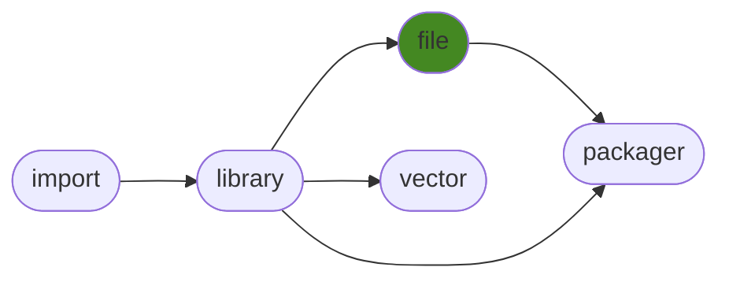

# generalfile
Easily manage files cross platform.

## Contents
<pre>
<a href='#generalfile'>generalfile</a>
├─ <a href='#Dependency-Tree'>Dependency Tree</a>
├─ <a href='#Installation'>Installation</a>
├─ <a href='#Information'>Information</a>
├─ <a href='#Attributes'>Attributes</a>
├─ <a href='#Contributions'>Contributions</a>
└─ <a href='#Todo'>Todo</a>
</pre>

## Dependency Tree

## Installation
| `pip install`                                                        | `generalfile`   | `generalfile[spreadsheet]`   | `generalfile[full]`   |
|:---------------------------------------------------------------------|:----------------|:-----------------------------|:----------------------|
| <a href='https://pypi.org/project/generallibrary'>generallibrary</a> | ✔️              | ✔️                           | ✔️                    |
| <a href='https://pypi.org/project/send2trash'>send2trash</a>         | ✔️              | ✔️                           | ✔️                    |
| <a href='https://pypi.org/project/appdirs'>appdirs</a>               | ✔️              | ✔️                           | ✔️                    |
| <a href='https://pypi.org/project/dill'>dill</a>                     | ✔️              | ✔️                           | ✔️                    |
| <a href='https://pypi.org/project/pandas'>pandas</a>                 | ❌               | ✔️                           | ✔️                    |

## Information
| Package                                                      | Ver                                             | Latest Release        | Python                                                                                                                                                                                  | Platform        |   Lvl | Todo                                                    | Cover   |
|:-------------------------------------------------------------|:------------------------------------------------|:----------------------|:----------------------------------------------------------------------------------------------------------------------------------------------------------------------------------------|:----------------|------:|:--------------------------------------------------------|:--------|
| [generalfile](https://github.com/ManderaGeneral/generalfile) | [2.5.11](https://pypi.org/project/generalfile/) | 2022-09-09 12:43 CEST | [3.8](https://www.python.org/downloads/release/python-380/), [3.9](https://www.python.org/downloads/release/python-390/), [3.10](https://www.python.org/downloads/release/python-3100/) | Windows, Ubuntu |     2 | [4](https://github.com/ManderaGeneral/generalfile#Todo) | 72.5 %  |

## Attributes
<pre>
<a href='https://github.com/ManderaGeneral/generalfile/blob/master/generalfile/__init__.py#L1'>Module: generalfile</a>
├─ <a href='https://github.com/ManderaGeneral/generalfile/blob/master/generalfile/errors.py#L6'>Class: CaseSensitivityError</a>
├─ <a href='https://github.com/ManderaGeneral/generalfile/blob/master/generalfile/configfile.py#L109'>Class: ConfigFile</a>
├─ <a href='https://github.com/ManderaGeneral/generalfile/blob/master/generalfile/errors.py#L10'>Class: InvalidCharacterError</a>
└─ <a href='https://github.com/ManderaGeneral/generalfile/blob/master/generalfile/path.py#L20'>Class: Path</a>
</pre>

## Contributions
Issue-creation and discussions are most welcome!

Pull requests are not wanted, please discuss with me before investing any time

## Todo
| Module                                                                                                                                               | Message                                                                                                                                                                                   |
|:-----------------------------------------------------------------------------------------------------------------------------------------------------|:------------------------------------------------------------------------------------------------------------------------------------------------------------------------------------------|
| <a href='https://github.com/ManderaGeneral/generalfile/blob/master/generalfile/optional_dependencies/path_spreadsheet.py#L1'>path_spreadsheet.py</a> | <a href='https://github.com/ManderaGeneral/generalfile/blob/master/generalfile/optional_dependencies/path_spreadsheet.py#L115'>Support DataFrame and Series with spreadsheet.append()</a> |
| <a href='https://github.com/ManderaGeneral/generalfile/blob/master/generalfile/path.py#L1'>path.py</a>                                               | <a href='https://github.com/ManderaGeneral/generalfile/blob/master/generalfile/path.py#L27'>Binary extension.</a>                                                                         |
| <a href='https://github.com/ManderaGeneral/generalfile/blob/master/generalfile/configfile.py#L1'>configfile.py</a>                                   | <a href='https://github.com/ManderaGeneral/generalfile/blob/master/generalfile/configfile.py#L117'>Handle custom serializers within iterable for ConfigFile.</a>                          |
| <a href='https://github.com/ManderaGeneral/generalfile/blob/master/generalfile/path_bases/path_lock.py#L1'>path_lock.py</a>                          | <a href='https://github.com/ManderaGeneral/generalfile/blob/master/generalfile/path_bases/path_lock.py#L12'>Lock the optional extra paths.</a>                                            |

Generated 2022-09-27 05:21 CEST for commit <a href='https://github.com/ManderaGeneral/generalfile/commit/master'>master</a>.

